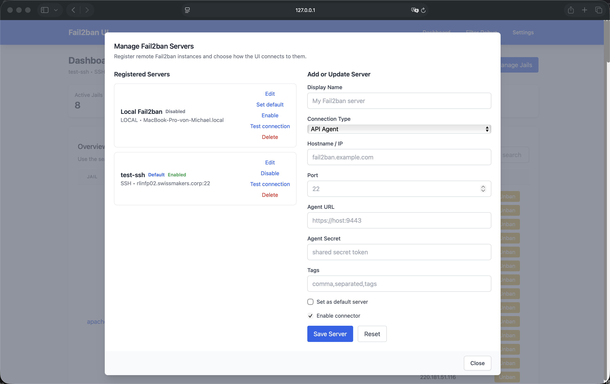
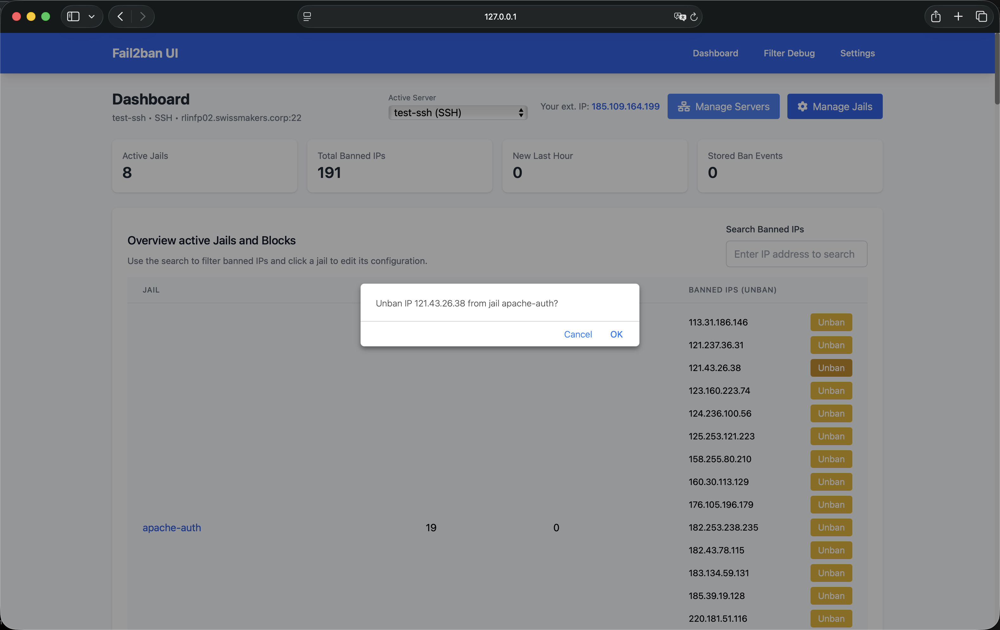
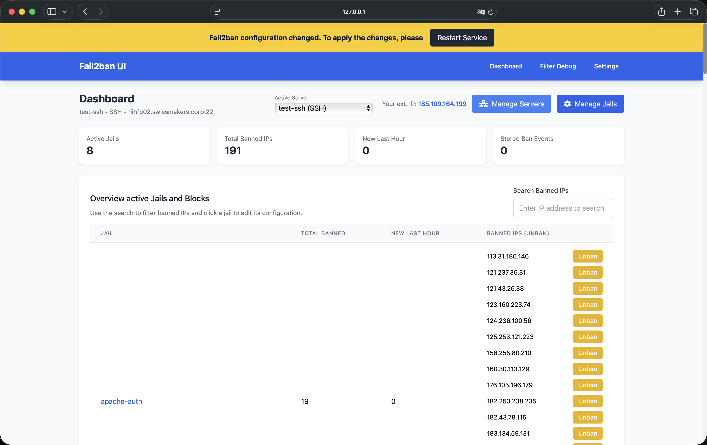
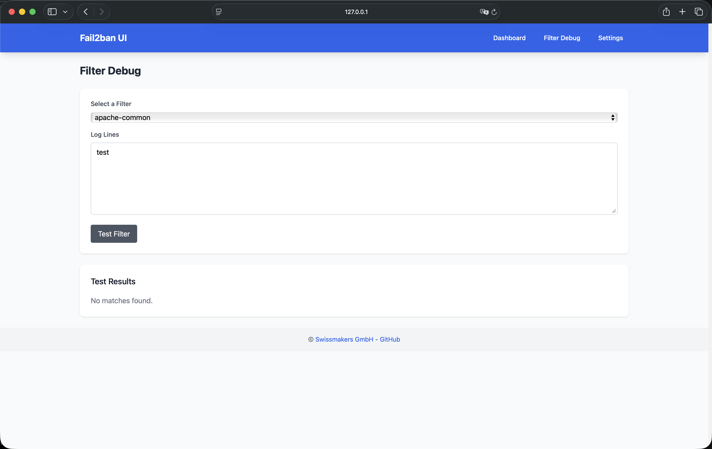
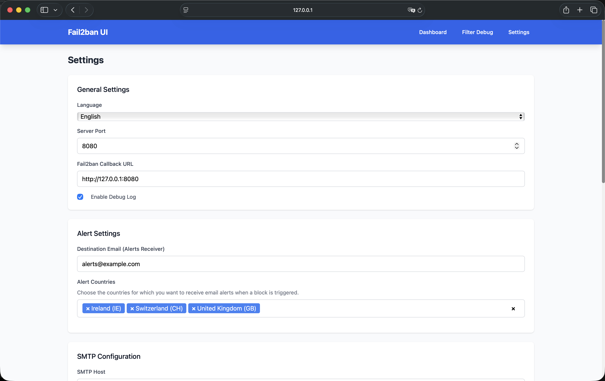
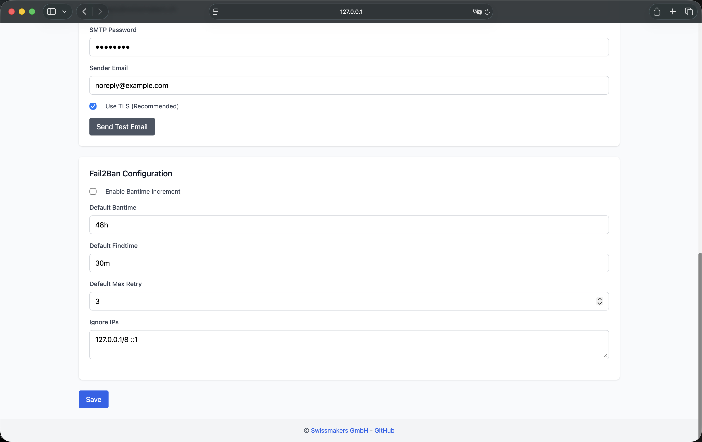

# Fail2Ban UI

<div align="center">

**Enterprise-Grade Intrusion Detection System Management Platform**

[](https://www.gnu.org/licenses/gpl-3.0)
[](https://golang.org/)
[](https://www.linux.org/)

*Swiss-made open-source solution for centralized Fail2Ban management across distributed infrastructure*

[Features](#-features) • [Quick Start](#-quick-start) • [Documentation](#-documentation) • [Screenshots](#-screenshots) • [Security Notes](#-security-notes)

</div>

---

## 🎯 Overview

**Fail2Ban UI** is a production-ready, enterprise-grade web-based management platform to create a distributed Fail2Ban intrusion detection system. Designed for organizations managing single or multible fail2ban instances. It provides centralized ban-control, real-time monitoring and alerting across all servers.

### Why we Need Fail2Ban UI

Modern enterprises face increasing security challenges with generally distributed infrastructure, cloud deployments, and multi-location operations. Traditional Fail2Ban management requires a manual SSH access to individual servers, manual configuration changes, and lacks centralized visibility. **Fail2Ban UI solves these challenges** by providing:

- **Centralized Management**: Control multible Fail2Ban instances from a single interface
- **Real-Time Visibility**: Monitor ban / security events across your entire proxy / webserver infrastructure (also planned to ingest all via connector to SIEM)
- **Operational Efficiency**: Reduce administrative overhead with automated workflows e.g. auto-banning for recurring IPs, directly  on the firewall.

**Developed by [Swissmakers GmbH](https://swissmakers.ch)** — Trusted by enterprises swisswide for mission-critical security infrastructure.

---

## 🚀 Current Features

### 🏢 Multi-Server Management

**Centralized Control Across Distributed Fail2Ban Instances**

- **Unified Dashboard**: Monitor and manage multiple Fail2Ban servers from a single interface
- **Flexible Connectivity**: Support for local, SSH, (and API agent) connections from Fail2Ban-UI to Fail2Ban Instances
- **API Agent Connector**: Technical preview; Basic API functionality available, full implementation in progress
- **Connection Testing**: Validate backend connectivity before activate them on the management UI

**Use Cases:**
- Multi-datacenter deployments with several reverse proxies
- Hybrid cloud environments
- Also integrate external Webservers

### 📊 Real-Time Security Intelligence

**Malicious Actor Visibility and Analytics**

- **Live Event Monitoring**: Real-time ban events from all configured / connected servers
- **Historical Analysis**: SQLite-based event storage with advanced querying
- **Geographic Intelligence**: Country-based threat analysis and visualization with GeoIP and whois lookups (Option to send the logs to a SIEM is planned)
- **Integrated Lookups**: Whois and GeoIP lookups are performed directly by Fail2Ban UI (no Linux binary dependencies anymore on fail2ban side)
- **Smart Log Filtering**: Automatic selection of most relevant log lines for ban notifications
- **Recurring Threat Detection**: Identify persistent attackers across time windows
- **Ban Insights Dashboard**: Aggregated statistics
- **Event Correlation**: Track attack patterns across multiple servers and jails (planned with Elasticsearch)

**Business Value:**
- Faster threat response times
- Proactive security posture management
- Compliance reporting and audit trails

### 🛡️ Advanced Ban Management

**IP Blocking and Unblocking**

- **Cross-Jail Search**: Find banned IPs across all active jails instantly
- **Bulk Operations**: Manage multiple bans simultaneously
- **Ban History**: Complete audit trail with timestamps, ban-reasons, and context including whois and GeoIP information of the attacker
- **Whitelist Management**: Configure trusted IPs and networks
- **Automatic Unban**: Time-based ban expiration with configurable policies
- **Permanent Ban for Reccuring IPs**: Set a threshold in the Settings, after what amount of Bans a IP is automatically banned permanently on Firewall (Currently Supported Mikrotik/PFSense)


### ⚙️ Configuration Management

- **Remote Configuration**: Edit Fail2Ban jail and filter configurations remotely
- **Jail Management**: Enable/disable jails across multiple servers
- **Filter Testing**: Debug and validate filters using `fail2ban-regex` before enabeling
- **Template Management**: Standardize configurations across server groups (planned)


### 📧 Alerting

**Security Notifications**

- **Multi-Language Email Alerts**: Localized notifications in currently 5 supported languages
- **Country-Based Filtering**: Alert only on threats from specific geographic regions to reduce alert fatigue
- **GeoIP Provider Selection**: Choose between MaxMind (needs a local database) or Built-in (ip-api.com) for geographic lookups
- **SMTP Integration**: Support M365 Mail-Servers with STARTTLS
- **Email Templates**: Currently features a Modern and classic email design (more to come)
- **Alert Aggregation**: This feature is planned for the SIEM-modul

### 🔐 Enterprise Security

**Hardened for Production Environments**

- **SELinux Support**: Full compatibility with SELinux-enabled systems and pre-created custom policies
- **Container Security**: Secure containerized deployment with proper best-practisies
- **Least Privilege**: Only minimal permissions are used using FACLs and special sudo-rules
- **Audit Logging**: Comprehensive logging for compliance and forensics also in the future planned to ingest into a Elastic SIEM
- **Encrypted Communications Only**: Secure data transmission for all remote operations will be enforced

### 🌐 Internationalization

- **Multi-Language UI**: English, German (DE/CH), French, Italian, Spanish
- **Localized Content**: All user-facing content translated
- **RTL Support Ready**: Architecture supports right-to-left languages
- **Easy Extension**: Simple JSON-based translation system

### 📱 Modern User Experience

- **Responsive Design**: Full functionality also on mobile devices
- **Progressive Web App**: Works also in a no-internet / offline and restricted environment with local CSS/JS builds only
- **Fast Performance**: Go-based backend with minimal resource footprint

---

## 📸 Screenshots

### Dashboard Overview
The central command center for monitoring all Fail2Ban instances and security events.


### Server Management
Add, configure, and manage multiple Fail2Ban servers from the "Manage Servers" modal.



### IP Search and Management
Quickly locate and review / manage banned IPs across all jails and servers.


### Unban Operations
One-click unban action with confirmation dialog.



### Configuration Editor
Edit Fail2Ban jail and filter configurations (with syntax highlighting - planned) and validation.


### Service Management
Reload or restart Fail2Ban services when needed, with integrated change detection.



### Filter Debugging
Test and validate Fail2Ban filters using `fail2ban-regex`.



### Settings and Configuration
Comprehensive settings management for alerts, advanced banning, and system preferences.





---

## 🏗️ Architecture

### System Components

```
 ┌────────────────────────────────────────────────────────────┐
 │                  Fail2Ban UI Web Interface                 │
 │  ┌──────────────┐  ┌──────────────┐  ┌──────────────┐      │
 │  │   Dashboard  │  │  Management  │  │   Settings   │      │
 │  └──────────────┘  └──────────────┘  └──────────────┘      │
 └────────────────────────────────────────────────────────────┘
                              │
                              ▼
┌────────────────────────────────────────────────────────────────┐
│                     Go Backend API Server                      │
│    ┌─────────────────────────────┐    ┌──────────────────────┐ │
│    │ Fail2Ban UI (Backend)       │--->│ Send Alerts via Mail │ │
│    │ - Gin handlers + REST API   │    │ (planned: Elastic)   │ │
│    │ - Vanilla JS + Tailwind UI  │    └──────────────────────┘ │
│  ->│ - SQLite storage            │                             │
│ │  └──────────────┬──────────────┘                             │
│ │                 │                                            │
│ │      ┌──────────┴────────────┐       ┌─────────────────────┐ │
│ │      │ Connector Manager and │-------│ Integrations        │ │
│ │      │ handlers / actions    │       │ Mikrotik / pfSense  │ │
│ │      └────────────────────┬──┘       └─────────────────────┘ │
│ │                           │                                  │
└─│───────────────────────────│──────────────────────────────────┘
  │                           │
  │                           ▼
┌─│─────────────────────────────────────────────────────────────┐
│ │               Connection to remote Server                   │
│ │              ─────────────────────────────                  │
│ │              │             │             │                  │
│ │              ▼             ▼             ▼                  │
│ │          ┌────────┐    ┌────────┐    ┌────────┐             │
│ │          │ Local  │    │  SSH   │    │  API   │             │
│ │          │ Server │    │ Server │    │ Agent  │             │
│ │          └────────┘    └────────┘    └────────┘             │
│ │              │             │             │                  │
│ │              │             │             │                  │
│ │        ┌─────┴─────────────┴─────────────┴─────┐            │
│ │        │ Fail2Ban instances on Reverse Proxies │            │
│ │        │ or remote / local Webserver           │            │
│ │        └─────────────┬─────────────────────────┘            │
│ │                      │                                      │
│ │           ┌──────────┴────────────┐                         │
│ │           │ Report Alerts back to │                         │
│  <----------│ Fail2Ban-UI REST with │                         │
│             │ custom action         │                         │
│             └───────────────────────┘                         │
└───────────────────────────────────────────────────────────────┘
```


### Technology Stack

- **Backend**: Go 1.24+ (Golang)
- **Frontend**: Vanilla JavaScript, Tailwind CSS
- **Database**: SQLite (embedded)
- **Container Runtime**: Podman/Docker compatible
- **Service Management**: systemd
- **Security**: SELinux compatible

---

## 🚀 Quick Start

### Prerequisites

- **Operating System**: Linux (RHEL 8+, Ubuntu 20.04+, Debian 11+, or containerized)
- **Fail2Ban**: At least version 0.10+ installed and configured
- **Go**: Version 1.24+ (only for source builds)
- **Node.js**: Version 16+ (only for source build - Tailwind CSS)
- **Permissions**: Root access to configure FACL and sudo-rules and Fail2Ban socket access

### Installation Methods (Example with mounts for local fail2ban connector)

#### Method 1: Container Deployment (Recommended for Production)

**Option A: Using Pre-built Image**

Pull and run the official image:
```bash
# Pull the image
podman pull registry.swissmakers.ch/infra/fail2ban-ui:latest
# or with Docker:
docker pull registry.swissmakers.ch/infra/fail2ban-ui:latest

# Run the container
podman run -d \
  --name fail2ban-ui \
  --network=host \
  -v /opt/podman-fail2ban-ui:/config:Z \
  -v /etc/fail2ban:/etc/fail2ban:Z \
  -v /var/log:/var/log:ro \
  -v /var/run/fail2ban:/var/run/fail2ban \
  registry.swissmakers.ch/infra/fail2ban-ui:latest
```

**Option B: Build from Source**

Build your own container image:
```bash
# Clone the repository
git clone https://github.com/swissmakers/fail2ban-ui.git
cd fail2ban-ui

# Build the image
sudo podman build -t fail2ban-ui:dev .
# or with Docker:
sudo docker build -t fail2ban-ui:dev .

# Run the container
sudo podman run -d \
  --name fail2ban-ui \
  --network=host \
  -v /opt/podman-fail2ban-ui:/config:Z \
  -v /etc/fail2ban:/etc/fail2ban:Z \
  -v /var/log:/var/log:ro \
  -v /var/run/fail2ban:/var/run/fail2ban \
  localhost/fail2ban-ui:dev
```

**Option C: Using Docker Compose**

For easier management, use Docker Compose:
```bash
# Copy the example file
cp docker-compose.example.yml docker-compose.yml
# or
cp docker-compose-allinone.example.yml docker-compose.yml

# Edit docker-compose.yml to customize (e.g., change PORT)
# Then start:
podman compose up -d 
# or
docker-compose up -d
```

**Custom Port Configuration**

Change the default port (8080) using the `PORT` environment variable:
```bash
podman run -d \
  --name fail2ban-ui \
  --network=host \
  -e PORT=3080 \
  -v /opt/podman-fail2ban-ui:/config:Z \
  -v /etc/fail2ban:/etc/fail2ban:Z \
  -v /var/log:/var/log:ro \
  -v /var/run/fail2ban:/var/run/fail2ban \
  registry.swissmakers.ch/infra/fail2ban-ui:latest
```

Access the web interface at `http://localhost:3080`.

**Volume Mounts Explained**

| Volume | Required | Purpose |
|--------|----------|---------|
| `/config` | ✅ Yes | Stores SQLite database, application settings, and SSH keys for remote connections |
| `/etc/fail2ban` | ✅ Yes* | Access to Fail2Ban configuration files (jails, filters, actions) |
| `/var/run/fail2ban` | ✅ Yes* | Access to Fail2Ban control socket for local management |
| `/var/log` | ✅ Yes* | Read-Only | `:ro` | System log files for automated logpath tests on jail management. |
| `/path/to/your/GeoIPFolder` | ⚠️ Optional | Read-Only | `:ro` | MaxMind GeoIP databases (only needed if using MaxMind provider) |

*Required only if managing a local Fail2Ban instance as well. Not needed for remote-only deployments.

**📖 [Complete Container Deployment Guide](./deployment/container/README.md)** - Detailed documentation including volume descriptions, SELinux configuration, and troubleshooting.

#### Method 2: Systemd Service (Standalone)

**Clone and build:**
```bash
git clone https://github.com/swissmakers/fail2ban-ui.git /opt/fail2ban-ui
cd /opt/fail2ban-ui

# Build Tailwind CSS (optional, for offline use)
./build-tailwind.sh

# Build Go application
go build -o fail2ban-ui ./cmd/server/main.go
```

**📖 [Complete Systemd Setup Guide](./deployment/systemd/README.md)**

### First Launch

1. **Access the Web Interface**
   - Navigate to `http://localhost:8080` (or your configured port)
   - Default port: `8080` (configurable via `PORT` environment variable or in UI settings)

2. **Add Your First Server**
   - **Local Server**: Enable the local connector if Fail2Ban runs on the same host
   - **Remote Server**: Add via SSH or API agent connection

3. **Configure Settings**
   - Set up email alerts
   - Configure language preferences
   - Adjust security settings

---

## 📚 Documentation

### Deployment Guides

- **[Container Deployment Guide](./deployment/container/README.md)**: 
  - Building container images from source
  - Running containers with Docker/Podman
  - Volume mount explanations (required vs optional)
  - Custom port configuration via `PORT` environment variable
  - Docker Compose examples
  - SELinux configuration
  - Troubleshooting common issues

- **[Systemd Service Setup](./deployment/systemd/README.md)**: Standalone installation and service configuration for non-containerized deployments

- **[SELinux Configuration](./deployment/container/SELinux/)**: Security policies for SELinux-enabled systems

### Connector Types

Fail2Ban UI supports three types of connectors to manage remote and or local only Fail2Ban instances:

#### Local Connector

The local connector manages Fail2Ban on the same host/vm/container-stack where Fail2Ban UI runs. It does that by directly communicating with the local Fail2Ban instance via socked, without network overhead.

**How it works:**
- Accesses the Fail2Ban control socket at `/var/run/fail2ban/fail2ban.sock`
- Reads and writes configuration files directly to `/etc/fail2ban/`
- Requires FACL (File Access Control Lists) rules and passwordless sudo permissions to `/usr/bin/fail2ban-client` (if not running as privileged e.g. in a container)

**When to use:**
- ✅ Fail2Ban UI and Fail2Ban run on the same server
- ✅ Single-server deployments
- ✅ Development or testing environments
- ✅ Maximum performance with zero network latency
- ✅ Simplest setup with minimal configuration

#### SSH Connector

The SSH connector connects to remote Fail2Ban instances over SSH, enabling centralized management of distributed infrastructure. (no need to install fail2ban-UI everyware)

**How it works:**
- Establishes SSH connections to remote servers using key-based authentication
- Transfers and manages configuration files encrypted over SSH
- Automatically deploys custom Fail2Ban actions to remote instances for callback API ban-communication
- Executes `fail2ban-client` commands remotely via SSH

**When to use:**
- ✅ Managing Fail2Ban instances on remote servers supporting SSH
- ✅ Multi-server deployments across different hosts / reverse proxies
- ✅ When Fail2Ban UI runs on a dedicated management server
- ✅ Environments where direct socket access is not possible

**Requirements:**
- SSH key-based authentication (passwordless login)
- Network connectivity from Fail2Ban UI host to remote server
- Service account on remote server with appropriate permissions
- Sudo access for Fail2Ban commands (configured via sudoers)
- File system ACLs on remote server with write-permissions for `/etc/fail2ban/` directory

#### API Agent Connector *(Technical Preview)*

The API agent connector uses a lightweight agent installed on remote servers that communicates bouth ways, to and from Fail2Ban UI via REST API.

**Status:** Implementation in progress

### Configuration Values

#### Fail2Ban Callback URL

The **Fail2Ban Callback URL** is a critical setting that determines how Fail2Ban instances send ban alerts back to Fail2Ban UI. This URL is embedded in a custom Fail2Ban action file as well as the secret that gets deployed to all managed Fail2Ban instances (both local and SSH). For the API agent connections, only the Callback URL and Secret is relevant.

**How it works:**
- When a Fail2Ban instance bans an IP, it executes the custom action which sends a POST request including the secret to the callback URL (`/api/ban` endpoint)
- If the secret is missing or wrong the request is dropped.
- If the secret is valid, Fail2Ban-UI receives these notifications and stores them in the database for monitoring and analysis
- The callback URL is automatically synchronized with the server port when using the default localhost pattern

**Configuration Guidelines:**

1. **Local Deployments:**
   - Use the same port as Fail2Ban UI: `http://127.0.0.1:8080` (or your configured port)
   - The callback URL automatically updates when you change the server port
   - Example: If Fail2Ban UI runs on port `3080`, use `http://127.0.0.1:3080`

2. **Reverse Proxy Setups:**
   - Use your TLS-encrypted endpoint: `https://fail2ban.example.com`
   - Ensure the reverse proxy forwards requests to the correct Fail2Ban UI port
   - The callback URL must be accessible from all Fail2Ban instances (local and remote)

3. **Port Changes:**
   - When you change the Fail2Ban UI port (via `PORT` environment variable or UI settings), the callback URL automatically updates if it's using the default localhost pattern
   - For custom callback URLs (e.g., reverse proxy or custom IP), you must manually update them to match your setup

**Important Notes:**
- The callback URL must be accessible from all Fail2Ban instances that need to send alerts
- For remote Fail2Ban instances, ensure network connectivity to the callback URL
- If using a reverse proxy, configure it to forward `/api/ban` requests to Fail2Ban UI
- The callback URL is stored in `/etc/fail2ban/action.d/ui-custom-action.conf` on each managed Fail2Ban instance

#### Adding a Local Server after initial setup

The local connector allows managing Fail2Ban on the same host where Fail2Ban UI runs.

**Enable in UI:**
1. Navigate to **Settings** → **Manage Servers**
2. Enable **Local Connector**
3. Test connection to verify access

#### Adding an SSH Server after initial setup

Connect to remote Fail2Ban instances via SSH for centralized management.

**Prerequisites:**
- SSH key-based authentication (passwordless login)
- Network connectivity from UI host to remote server
- Service account with appropriate permissions

**Recommended Service Account Setup:**

```bash
# Create dedicated service account
sudo useradd -r -s /bin/bash sa_fail2ban

# Configure sudoers for Fail2Ban operations
sudo visudo -f /etc/sudoers.d/fail2ban-ui
```

Add the following sudoers configuration:
```
sa_fail2ban ALL=(ALL) NOPASSWD: /usr/bin/fail2ban-client *
sa_fail2ban ALL=(ALL) NOPASSWD: /usr/bin/systemctl restart fail2ban
```

**Set file system ACLs:**
```bash
# Grant read/write access to Fail2Ban configuration directory
sudo setfacl -Rm u:sa_fail2ban:rwX /etc/fail2ban
sudo setfacl -dRm u:sa_fail2ban:rwX /etc/fail2ban
```

**Add Server in UI:**
1. Navigate to **Settings** → **Manage Servers**
2. Click **Add Server**
3. Select **SSH** connection type
4. Configure:
   - **Name**: Descriptive server identifier
   - **Host**: IP address or hostname (ip is always better, if DNS fails for some reason)
   - **Port**: SSH port (default: 22)
   - **SSH User**: Service account username
   - **SSH Key**: Select from `~/.ssh/` directory
5. Tick "Enable connector"
6. Save configuration
7. Click **Test Connection** to verify

---

### 🔒 Security Notes

#### Network Security Best Practices

- **Reverse Proxy**: Use nginx or Apache as reverse proxy with SSL/TLS termination to secure the Fail2ban-UI
- **VPN Access**: Require VPN connection for access to Fail2Banu-UI only
- **IP Whitelisting**: Restrict access to specific IPs / ranges e.g. internal IT

#### Authentication and Authorization

- **SSH Key Management**: Use strong SSH keys like 4096-bit RSA or even better Ed25519. When using RSA no smaller bit size please.
- **Service Accounts**: Use dedicated service accounts, not personal accounts
- **Sudoers Configuration**: Minimal sudo permissions, no passwordless full sudo
- **Callback Secret**: Auto-generated secret authenticates all ban notification requests; keep it secure and never expose

#### Data Protection

- **Database Permissions**: Restrict SQLite database file permissions (600)
- **Log Files**: Secure log file access and don't forget to setup a rotation
- **Backup Encryption**: It's always a good idea, to encrypt backups of configuration and database files

#### SELinux Configuration

For SELinux-enabled systems, apply the required policies:

```bash
# Basic rule to allow Fail2Ban to access the UI API
semodule -i fail2ban-curl-allow.pp

# Container deployment policies
semodule -i fail2ban-container-ui.pp
semodule -i fail2ban-container-client.pp
```

**📖 [SELinux Policies Documentation](./deployment/container/SELinux/)**

---

### 🗄️ Database Notes

#### SQLite Database Schema

Fail2Ban UI uses an embedded SQLite database (`fail2ban-ui.db`) for persistent storage:

**Tables:**
- **`servers`**: Server configurations (local, SSH, API agent)
- **`app_settings`**: Application preferences and settings of Fail2Ban-UI
- **`ban_events`**: Historical ban records with full context
- **`permanent_blocks`**: Permanent block records for integrations

**Data Retention:**
- Ban events are stored indefinitely (configurable)
- Automatic database migrations on version updates
- Backup recommended before major updates

---

### 🌍 Internationalization Notes

#### Currently Supported Languages

- **English** (en) - Default
- **German** (de, de_CH) - Standard and Swiss variants
- **French** (fr)
- **Italian** (it)
- **Spanish** (es)

#### Adding New Languages

1. Create translation file: `internal/locales/{language_code}.json`
2. Copy structure from `internal/locales/en.json`
3. Translate all key-value pairs
4. Test in UI: **Settings** → **Language** → Select new language

**Translation File Structure:**
```json
{
  "page.title": "Fail2ban UI Dashboard",
  "nav.dashboard": "Dashboard",
  "nav.settings": "Settings",
  ...
}
```

---

### 📊 API Reference

Fail2Ban UI provides a RESTful API for programmatic access:

#### Endpoints

**Server Management:**
- `GET /api/servers` - List all configured servers
- `POST /api/servers` - Add or update server
- `DELETE /api/servers/:id` - Remove server
- `POST /api/servers/:id/test` - Test server connection

**Jail Management:**
- `GET /api/summary` - Get summary of all jails
- `POST /api/jails/:jail/unban/:ip` - Unban IP address
- `GET /api/jails/manage` - List jail management status
- `POST /api/jails/manage` - Update jail enabled states

**Configuration:**
- `GET /api/jails/:jail/config` - Get jail/filter configuration
- `POST /api/jails/:jail/config` - Update jail/filter configuration

**Events and Analytics:**
- `GET /api/events/bans` - List ban events
- `GET /api/events/bans/stats` - Get ban statistics
- `GET /api/events/bans/insights` - Get ban insights and analytics

**Settings:**
- `GET /api/settings` - Get application settings
- `POST /api/settings` - Update application settings
- `POST /api/settings/test-email` - Test email configuration

**Filter Debugging:**
- `GET /api/filters` - List available filters
- `POST /api/filters/test` - Test filter against log lines

**Service Control:**
- `POST /api/fail2ban/restart` - Restart Fail2Ban service

**Notifications:**
- `POST /api/ban` - Receive ban notification from Fail2Ban
  - **Authentication**: Requires `X-Callback-Secret` header with valid secret
  - **Request Body**: JSON with `serverId`, `ip`, `jail`, `hostname`, `failures`, `logs`
  - **Response**: 200 OK on success, 401 Unauthorized if secret is invalid

---

## 🛠️ Troubleshooting

### Common Issues

#### UI Not Accessible

**Symptoms:** Cannot access web interface

**Solution / Check:**
```bash
# Check if service is running
systemctl status fail2ban-ui

# Check firewall rules
sudo firewall-cmd --list-ports
sudo firewall-cmd --add-port=8080/tcp --permanent
sudo firewall-cmd --reload

# Check logs
journalctl -u fail2ban-ui.service -f
```

#### No Servers Configured

**Symptoms:** Empty dashboard, no servers visible

**Solution / Check:**
1. Navigate to **Settings** → **Manage Servers**
2. Enable **Local Connector** (if Fail2Ban runs locally)
3. Add remote server via SSH or API agent
4. Verify server connection status

#### SSH Connection Issues

**Symptoms:** Cannot connect to remote server

**Solution / Check:**
```bash
# Test SSH connection manually
ssh -i ~/.ssh/your_key user@remote-host

# Verify SSH user permissions
sudo -l -U sa_fail2ban

# Check ACLs on /etc/fail2ban
getfacl /etc/fail2ban

# Enable debug mode in UI settings for detailed error messages
```

#### Local Connector Not Working

**Symptoms:** Local server shows as disconnected

**Solution / Check:**
```bash
# Verify Fail2Ban is running
sudo systemctl status fail2ban

# Check socket permissions
ls -la /var/run/fail2ban/fail2ban.sock

# Verify UI has access (runs as root or has sudo permissions)
sudo fail2ban-client status
```

#### Database Errors

**Symptoms:** Database-related errors in logs

**Solution / Check:**
```bash
# Check database file permissions
ls -la /opt/fail2ban-ui/fail2ban-ui.db

# Verify database integrity
sqlite3 /opt/fail2ban-ui/fail2ban-ui.db "PRAGMA integrity_check;"

# Backup and recreate if corrupted
cp fail2ban-ui.db fail2ban-ui.db.backup
```

---

## 🤝 Contributing

We welcome contributions from the community! Whether it's bug fixes, feature enhancements, or documentation improvements, your contributions help make Fail2Ban UI better for everyone.

### How to Contribute

1. **Fork the Repository**
   ```bash
   git clone https://github.com/swissmakers/fail2ban-ui.git
   cd fail2ban-ui
   ```

2. **Create a Feature Branch**
   ```bash
   git checkout -b feature/your-feature-name
   ```

3. **Make Your Changes**
   - Follow Go coding standards
   - Add tests for new features
   - Update documentation as needed

4. **Commit Your Changes**
   ```bash
   git commit -m "Add: Description of your feature"
   ```

5. **Push and Create Pull Request**
   ```bash
   git push origin feature/your-feature-name
   ```

### Contribution Guidelines

- **Code Style**: Follow Go standard formatting (`gofmt`)
- **Testing**: Test your changes thoroughly
- **Documentation**: Update README and inline documentation
- **Commit Messages**: Use clear, descriptive commit messages
- **Pull Requests**: Provide detailed description of changes

---

## 📜 License

Fail2Ban UI is licensed under the **GNU General Public License v3.0 (GPL-3.0)**.

This means:
- ✅ **Free to use** in commercial and non-commercial projects
- ✅ **Free to modify** and distribute
- ✅ **Source code available** for inspection and auditing
- ⚠️ **Copyleft**: Modifications must be released under the same license

**Full License Text:** [LICENSE](./LICENSE)

---

## 🏢 Enterprise Support

### Professional Services

**Swissmakers GmbH** offers professional services for Fail2Ban UI:

- **Enterprise Deployment**: Custom deployment and configuration
- **Training and Support**: On-site or remote training sessions
- **Custom Development**: Feature development and integrations
- **Security Audits**: Security assessment and hardening

**Contact:** [https://swissmakers.ch](https://swissmakers.ch)

### Community Support

- **GitHub Issues**: [Report bugs and request features](https://github.com/swissmakers/fail2ban-ui/issues)
- **Documentation**: Comprehensive guides and API reference
- **Community**: Join discussions and share experiences

---

## 🙏 Acknowledgments

Fail2Ban UI is built on the foundation of the excellent [Fail2Ban](https://www.fail2ban.org/) project and the open-source community.

**Special Thanks:**
- Fail2Ban developers and contributors
- Go community and ecosystem
- All contributors and users of Fail2Ban UI

---

<div align="center">

**Fail2Ban UI** — *Enterprise-Grade Intrusion Detection System Management*

</div>