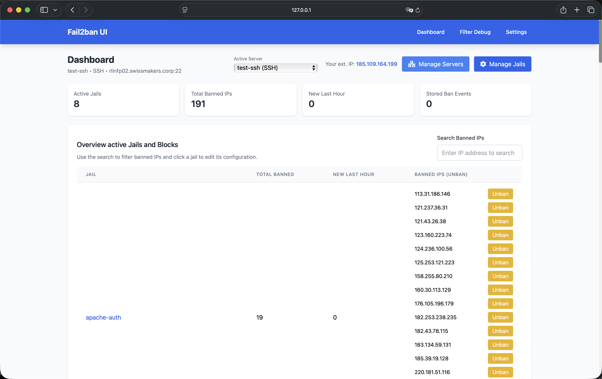
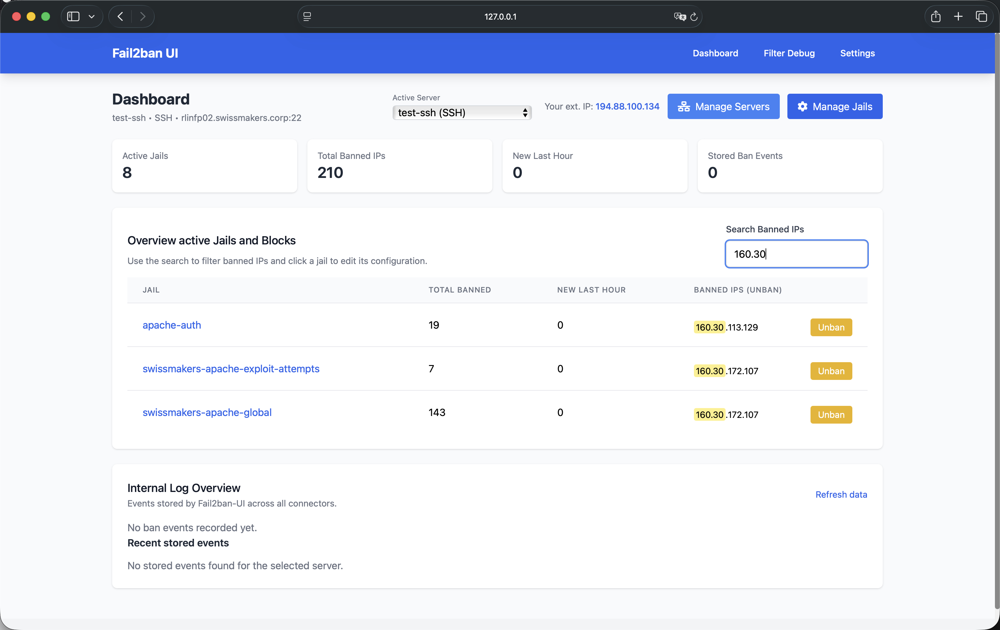
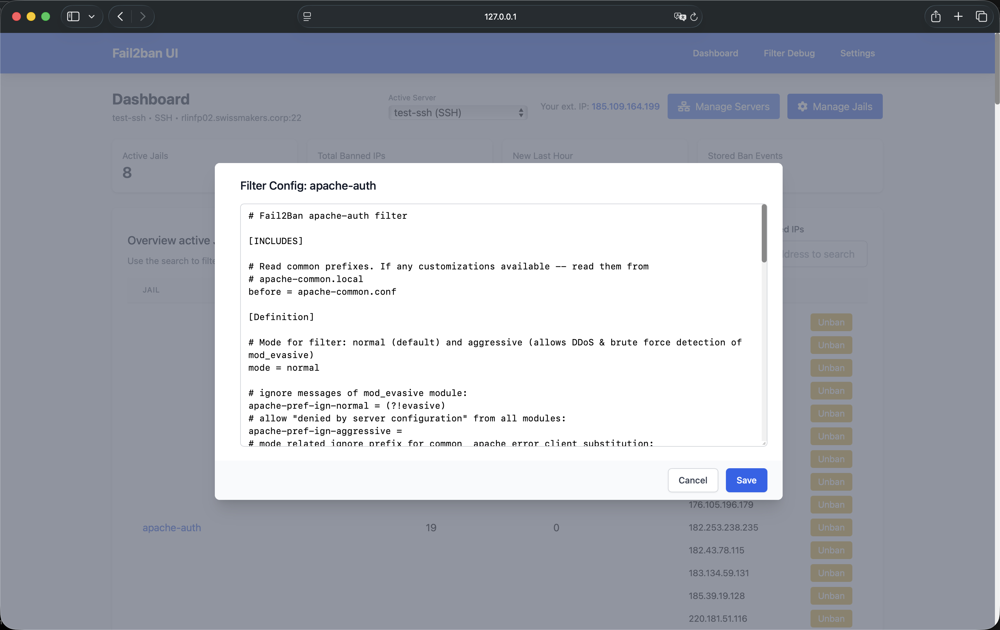

# **Fail2Ban UI**

🚀 **Fail2Ban-UI** is a Swiss-made **web-based management interface** for [Fail2Ban](https://www.fail2ban.org/).
It provides an intuitive dashboard to **monitor, configure, and manage Fail2Ban** instances in real time, supporting both local and remote Fail2ban servers.

Developed by **[Swissmakers GmbH](https://swissmakers.ch)**.

## **✨ Features**

✅ **Multi-Server Management**
- Manage **multiple Fail2ban servers** from a single interface
- Support for **local**, **SSH**, and **API agent** connections
- Add, edit, delete, and configure remote Fail2ban instances
- Switch between servers seamlessly via server selector
- Test connections before saving server configurations

✅ **Real-time Dashboard**
- View **all active Fail2Ban jails** and **banned IPs** in a clean UI
- Displays **live ban events** from all configured servers
- **Internal log overview** with ban events stored in SQLite database
- Statistics per server and global overview
- Track ban events with country information and log lines

✅ **Ban & Unban Management**
- **Unban IPs** directly via the UI (works for local and remote servers)
- **Search** for banned IPs across all active jails
- View ban history with detailed information (IP, jail, hostname, country, logs)

✅ **Fail2Ban Configuration Management**
- **Edit & Save** active Fail2Ban jail/filter configs (local and remote)
- **Manage Jails**: Enable/disable jails on local and remote servers
- **Filter Debug**: Test filters against log lines using `fail2ban-regex`
- Get automatic **email alerts** for specific country-based bans
- Configure own SMTP settings for email alerts (STARTTLS only)
- Adjust default ban time, find time, and set ignore IPs
- Auto-detects changes and prompts for **reload** to apply
- Enable debug-mode for detailed module logs

✅ **SSH Remote Management**
- Connect to remote Fail2ban servers via SSH
- Automatic deployment of custom action for ban notifications
- Passwordless sudo support for seamless operation
- Configurable SSH key selection per server
- Test SSH connections before saving

✅ **API Agent Support** (Future)
- Connect to remote Fail2ban instances via lightweight API agents
- Secure communication using shared secrets
- Push ban notifications from remote servers to the UI

✅ **Persistent Storage**
- **SQLite database** for storing server configurations and ban events
- All settings and server configurations persist across restarts
- Automatic migration from legacy JSON-based settings

✅ **Mobile-Friendly & Responsive UI / Fast**
- Optimized for **mobile & desktop**
- Powered by **Bootstrap 5**
- **Go-based backend** ensures minimal resource usage
- Parallel execution for improved performance on remote connections

✅ **Systemd & SELinux Support**
- **Run as a systemd service** (Standalone or Container)
- **Supports SELinux** for secure execution (also container version)

✅ **Internationalization**
- Multi-language support (English, German, French, Italian, Spanish)
- Easy to add new languages via JSON translation files

## **📸 Screenshots**
Some images from the UI in action:

| Dashboard | Server Management | Filter Debug |
|-----------|-------------------|--------------|
|  |  |  |

📌 **More screenshots are found [here](./screenshots/)**

---

## **📥 Installation & Deployment**

Fail2Ban-UI can be currently deployed in **two main ways**:  
**1️⃣ Running from local source**  
**2️⃣ Running as a container**  

### **🔹 Method 1: Running from Local Source**
To install and run directly on the system:  
📌 **[Follow the basic systemd setup guide](./deployment/systemd/README.md)**  

```bash
git clone https://github.com/swissmakers/fail2ban-ui.git /opt/fail2ban-ui
cd /opt/fail2ban-ui
go build -o fail2ban-ui ./cmd/server/main.go
...
```

---

### **🔹 Method 2: Running as a Container**
For an easy containerized deployment:  
📌 **[Follow the basic container deployment guide](./deployment/container/README.md)**  

```bash
podman run -d \
  --name fail2ban-ui \
  --network=host \
  -v /opt/podman-fail2ban-ui:/config:Z \
  -v /etc/fail2ban:/etc/fail2ban:Z \
  -v /var/log:/var/log:ro \
  -v /var/run/fail2ban:/var/run/fail2ban \
  -v /usr/share/GeoIP:/usr/share/GeoIP:ro \
  localhost/fail2ban-ui
```

> **📌 Note:** The container can also be managed as a **systemd service**.

---

## **🚀 Getting Started**

### **First Launch**
1. After starting Fail2Ban-UI, access the web interface at `http://localhost:8080` (or your configured port)
2. You'll be prompted to **add your first Fail2ban server** or **enable the local connector**
3. For local connections: Enable the local connector if Fail2ban is running on the same host
4. For remote connections: Add a new server via SSH or API agent

### **Adding a Server**

#### **Local Server**
- The local connector is available by default but **disabled** initially
- Enable it in the server management settings if Fail2ban runs on the same host
- Requires root access or passwordless sudo to the Fail2ban socket

#### **SSH Server**
1. Go to **Settings** → **Manage Servers**
2. Click **Add Server**
3. Select **SSH** as connection type
4. Fill in:
   - **Name**: A descriptive name for this server
   - **Host**: IP address or hostname
   - **Port**: SSH port (default: 22)
   - **SSH User**: Username for SSH connection
   - **SSH Key**: Select an SSH key from your `~/.ssh/` directory
5. Click **Test Connection** to verify before saving
6. The UI will automatically deploy the custom action for ban notifications

**Requirements for SSH connections:**
- SSH key-based authentication (passwordless login)
- Passwordless sudo access to `fail2ban-client` and Fail2ban configuration files
- Network connectivity from UI host to remote server

#### **API Agent Server** (Future)
- API agent support is planned for future releases
- Will allow connecting to remote Fail2ban instances via a lightweight API service

---

## **🔒 Security Considerations**

- Fail2Ban-UI requires **root privileges** or **passwordless sudo** to interact with Fail2Ban sockets.  
- **Restrict access** using **firewall rules** or a **reverse proxy** with authentication.  
- Ensure that Fail2Ban logs/configs **aren't exposed publicly**.  
- For SSH connections, use **SSH key-based authentication** and restrict SSH access.
- Store SSH keys securely and use strong passphrases.
- The SQLite database contains sensitive information - ensure proper file permissions.

For **SELinux users**, apply the **Fail2Ban-UI security policies**:  
```bash
# Basic rule to allow fail2ban access the fail2ban-ui API
semodule -i fail2ban-curl-allow.pp
# Also needed for a secure container deployment
semodule -i fail2ban-container-ui.pp
semodule -i fail2ban-container-client.pp
```

---

## **🛠️ Troubleshooting**

### **UI not accessible?**
- Ensure **port 8080** (or your configured port) is open:
  ```bash
  sudo firewall-cmd --add-port=8080/tcp --permanent
  sudo firewall-cmd --reload
  ```
- Check logs:
  ```bash
  journalctl -u fail2ban-ui.service -f
  ```

### **No servers configured?**
- On first launch, you need to either:
  - Enable the local connector (if Fail2ban runs locally)
  - Add a remote server via SSH or API agent
- Go to **Settings** → **Manage Servers** to configure your first server

### **SSH connection issues?**
- Verify SSH key authentication works manually:
  ```bash
  ssh -i ~/.ssh/your_key user@remote-host
  ```
- Ensure passwordless sudo is configured:
  ```bash
  sudo -l
  ```
- Check debug mode in settings for detailed error messages
- Verify the SSH user has access to `/var/run/fail2ban/fail2ban.sock`

### **Local connector not working?**
- Ensure Fail2ban is running: `sudo systemctl status fail2ban`
- Check socket permissions: `ls -la /var/run/fail2ban/fail2ban.sock`
- Verify the UI has access (runs as root or has sudo permissions)

### **Database issues?**
- The SQLite database is stored in the application directory
- Check file permissions if you see database errors
- Backup the database before major updates

---

## **📊 Database**

Fail2Ban-UI uses an embedded **SQLite database** (`fail2ban-ui.db`) to store:
- **Server configurations**: All configured Fail2ban servers (local, SSH, API agent)
- **Application settings**: UI preferences, SMTP settings, etc.
- **Ban events**: Historical ban records with IP, jail, hostname, country, and log lines

The database is automatically created on first launch and migrated from legacy JSON settings if present.

---

## **🌐 Internationalization**

Fail2Ban-UI supports multiple languages:
- English (en)
- German (de, de_ch)
- French (fr)
- Italian (it)
- Spanish (es)

Change the language in **Settings** → **Language**. New languages can be added by creating translation files in `internal/locales/`.

---

## **🤝 Contributing**
We welcome **pull requests** and **feature suggestions**!

1. **Fork** this repository
2. **Create** a new branch:  
   ```bash
   git checkout -b feature/my-feature
   ```
3. **Commit** your changes:  
   ```bash
   git commit -m "Add new feature"
   ```
4. **Push** to the branch:  
   ```bash
   git push origin feature/my-feature
   ```
5. **Open** a Pull Request  


## **📜 License**
Fail2Ban-UI is licensed under **GNU GENERAL PUBLIC LICENSE, Version 3**.  
See [`LICENSE`](./LICENSE) for details.
